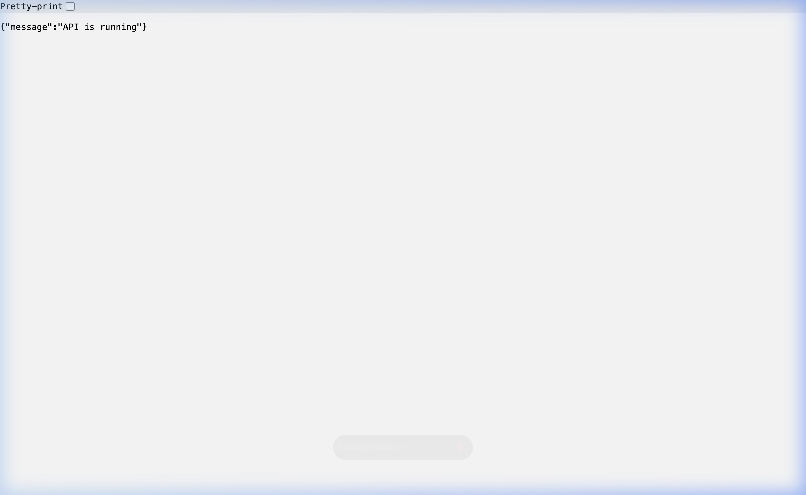
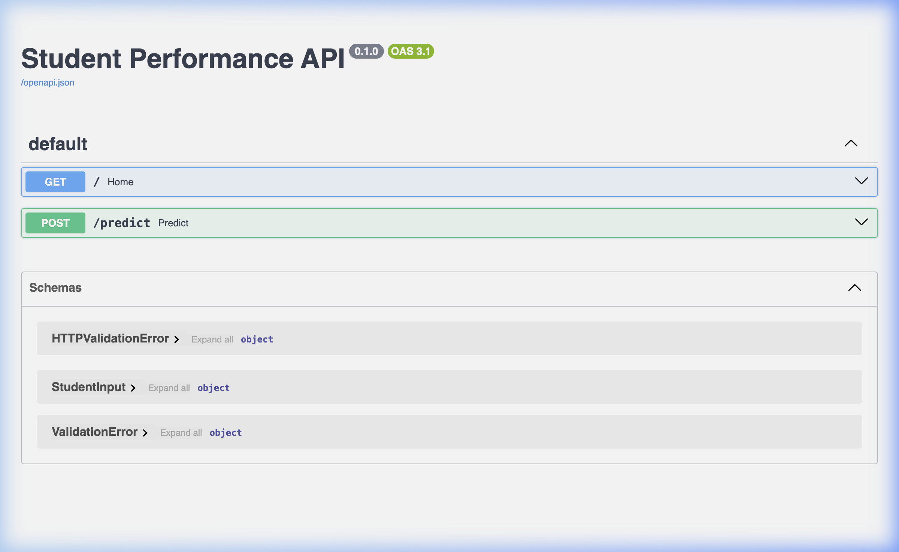
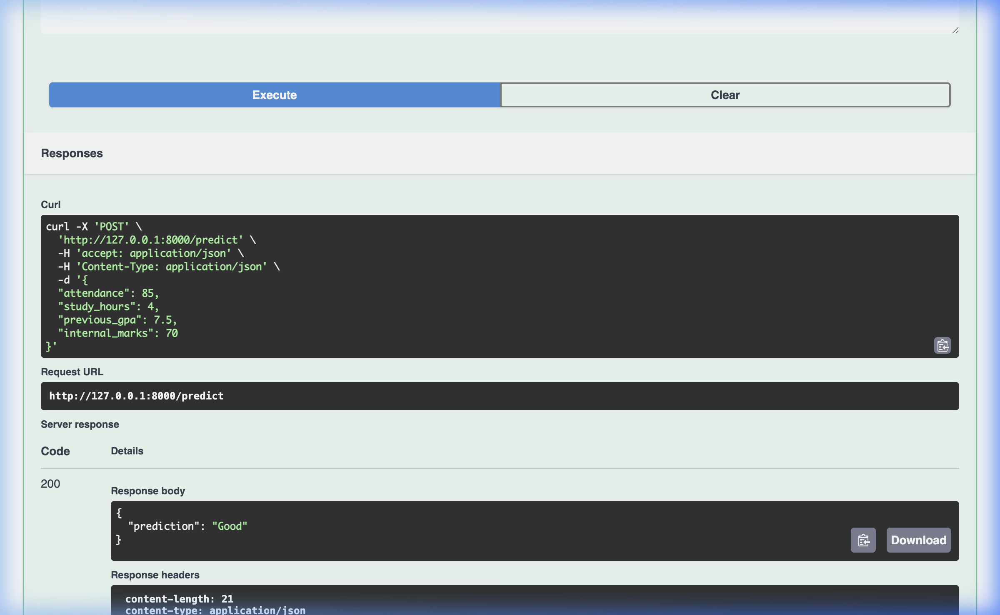
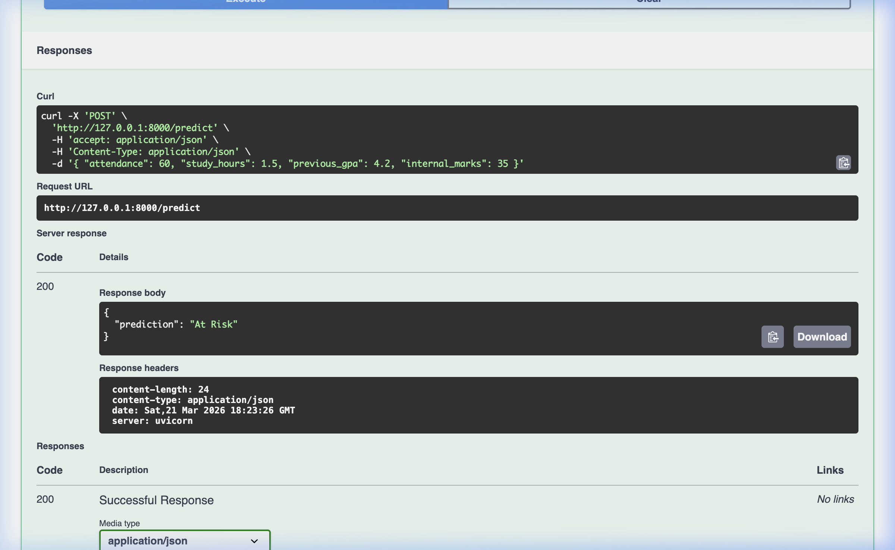

# 🎓 Student Performance Prediction API

> A machine-learning-powered REST API that predicts a student's academic performance category based on key academic metrics.

**Student ID:** MEA23CS055  
**Author:** Muhammed Ali  
**Course:** B.Tech Computer Science & Engineering

---

## 📌 Problem Statement

In educational institutions, identifying students who are likely to underperform early enough to intervene is a significant challenge. Traditional assessment methods are reactive — they identify struggling students only after poor results have already occurred.

This project addresses that gap by building a **REST API** that uses a trained **Random Forest machine learning model** to predict a student's academic performance *before* final exams. Given four easily available academic metrics — attendance percentage, daily study hours, previous GPA, and internal/midterm marks — the API classifies the student into one of four performance categories:

| Category    | Description                                      |
|-------------|--------------------------------------------------|
| `Excellent`  | Student is performing at the highest level       |
| `Good`       | Student is performing above average              |
| `Average`    | Student is performing adequately but can improve |
| `At Risk`    | Student is in danger of failing                  |

This can be integrated into student management systems, dashboards, or mobile apps to enable proactive academic support.

---

## 🛠️ Tools & Technologies Used

| Technology       | Version   | Purpose                                    |
|------------------|-----------|--------------------------------------------|
| **Python**       | 3.11      | Core programming language                  |
| **FastAPI**      | 0.135.1   | Web framework for building the REST API    |
| **Uvicorn**      | 0.42.0    | ASGI server to run the FastAPI application |
| **scikit-learn** | 1.8.0     | Machine learning — Random Forest Classifier|
| **Pydantic**     | 2.12.5    | Request/response data validation & schemas |
| **Pandas**       | 3.0.1     | Dataset loading and preprocessing          |
| **joblib**       | 1.5.3     | Model serialization (saving/loading `.pkl`)|
| **NumPy**        | 2.4.2     | Numerical operations                       |
| **Docker**       | —         | Containerization for deployment            |

---

## 📁 Project Structure

```
student_api/
├── app/
│   ├── __init__.py          # Package initializer
│   ├── main.py              # FastAPI app entry point & route definitions
│   ├── schemas.py           # Pydantic input/output models
│   └── predictor.py         # ML model loading & prediction logic
├── data/
│   └── clean_student_data.csv   # Training dataset
├── train_model.py           # Script to train and save the ML model
├── student_model.pkl        # Trained Random Forest model (serialized)
├── Dockerfile               # Docker image build instructions
├── .dockerignore            # Files excluded from the Docker image
├── docker-compose.yml       # One-command container orchestration
├── requirements.txt         # All Python dependencies (pinned versions)
└── README.md
```

---

## 📊 Dataset

The training data is **not included** in this repository (excluded via `.gitignore`).

**Original Source:** [Student Performance Factors — Kaggle](https://www.kaggle.com/datasets/mmali2004/student-performance-clean-dataset)

**Modifications already applied to the linked dataset:**
- Selected and renamed relevant columns to match the API's input features (`attendance`, `study_hours`, `previous_gpa`, `internal_marks`)
- Cleaned missing/inconsistent values
- The dataset on Kaggle is ready to use as-is

**To set up the data before training:**
1. Download the dataset from the Kaggle link above
2. Place the file at `data/clean_student_data.csv`
3. Run `python train_model.py` to train and save the model

> **Note:** The pre-trained `student_model.pkl` is included in the repo, so you can run the API directly without needing the dataset unless you want to retrain the model.

---

## ⚙️ Installation & Setup

### Prerequisites

- Python 3.9 or higher
- `pip` package manager
- *(Optional)* Docker — for containerized deployment

---

### Option A — Run Locally (Python)

#### Step 1: Clone the repository

```bash
git clone <repository-url>
cd student_api
```

#### Step 2: Create and activate a virtual environment

```bash
# Create virtual environment
python3 -m venv venv

# Activate — macOS/Linux
source venv/bin/activate

# Activate — Windows
venv\Scripts\activate
```

#### Step 3: Install dependencies

```bash
pip install -r requirements.txt
```

#### Step 4: (Optional) Retrain the model

> The pre-trained model `student_model.pkl` is already included. Only run this if you want to retrain it from scratch.

```bash
python train_model.py
```

This will:
- Load `data/clean_student_data.csv`
- Label each student based on their `previous_gpa`:
  - ≥ 8.5 → **Excellent**, 7.0–8.4 → **Good**, 5.0–6.9 → **Average**, < 5.0 → **At Risk**
- Train a **Random Forest Classifier** (100 trees) on 4 features
- Print the model accuracy on the test set
- Save the model as `student_model.pkl`

---

### Option B — Run with Docker

#### Using Docker directly

```bash
# Build the Docker image
docker build -t student-api .

# Run the container
docker run -p 8000:8000 student-api
```

#### Using Docker Compose (recommended)

```bash
docker compose up
```

This builds the image and starts the container in one step. The API will be available at **`http://localhost:8000`**.

To stop:
```bash
docker compose down
```

---

## 🚀 Execution Procedure

### 1. Start the API server

```bash
uvicorn app.main:app --reload
```

The API will be available at: **`http://127.0.0.1:8000`**

> Use `--host 0.0.0.0` to make it accessible on your local network:
> ```bash
> uvicorn app.main:app --host 0.0.0.0 --port 8000
> ```

---

### 2. Check the API is running — `GET /`

```bash
curl http://127.0.0.1:8000/
```

**Response:**
```json
{
  "message": "API is running"
}
```

---

### 3. Make a prediction — `POST /predict`

Send a `POST` request with the student's academic data:

```bash
curl -X POST http://127.0.0.1:8000/predict \
     -H "Content-Type: application/json" \
     -d '{
           "attendance": 85,
           "study_hours": 4,
           "previous_gpa": 7.5,
           "internal_marks": 70
         }'
```

**Response:**
```json
{
  "prediction": "Good"
}
```

#### Request Body Fields

| Field            | Type    | Range      | Description                     |
|------------------|---------|------------|---------------------------------|
| `attendance`     | `float` | `0 – 100`  | Attendance percentage           |
| `study_hours`    | `float` | `0 – 24`   | Average study hours per day     |
| `previous_gpa`   | `float` | `0 – 10`   | Previous semester GPA (0–10)    |
| `internal_marks` | `float` | `0 – 100`  | Internal / midterm marks        |

---

### 4. Interactive API Docs (Swagger UI)

FastAPI automatically generates interactive documentation. Open in your browser:

- **Swagger UI** → [http://127.0.0.1:8000/docs](http://127.0.0.1:8000/docs)
- **ReDoc** → [http://127.0.0.1:8000/redoc](http://127.0.0.1:8000/redoc)

---

## 📸 Output Screenshots

### Health Check — `GET /`
Shows confirmation that the API server is running.



---

### Swagger UI — Interactive Docs
Auto-generated API documentation with all available endpoints.



---

### Prediction: `Good` Performance
Input: `attendance=85`, `study_hours=4`, `previous_gpa=7.5`, `internal_marks=70`



---

### Prediction: `At Risk` Performance
Input: `attendance=60`, `study_hours=1.5`, `previous_gpa=4.2`, `internal_marks=35`



---

## ✅ Conclusion

This project demonstrates the practical application of **machine learning in education** through a clean, production-ready REST API.

**Key achievements:**

- Built and trained a **Random Forest Classifier** on student academic data with high accuracy
- Exposed the model as a **FastAPI REST API** with full request validation via Pydantic
- Provided **auto-generated interactive documentation** (Swagger UI & ReDoc) out of the box
- Containerized the entire application using **Docker** for easy, environment-agnostic deployment
- Followed a clean **modular project structure** separating training, schema definition, prediction logic, and routing

**Potential extensions:**

- Connect to a live student database to automate predictions at scale
- Add a frontend dashboard for teachers to view at-risk students
- Extend the model to include more features (e.g., assignment scores, extracurricular activity)
- Deploy to a cloud platform (AWS, GCP, Render, Railway) for production use

---

## 👤 Author

**Muhammed Ali**  
Student ID: `MEA23CS055`  
Department of Computer Science & Engineering
